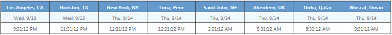

# Content Editor Examples
Various content editor Webparts I've used in SharePoint

## Example Webparts
* [Filter_SharePoint_List_View_by_Letter](Filter_SharePoint_List_View_by_Letter.dwp)
* [Slideshow_Banner_Example](Slideshow_Banner_Example.dwp)
* [Timezones_with_Temp](Timezones_with_Temp.dwp)
<h1 align="left">
  
</h1>

